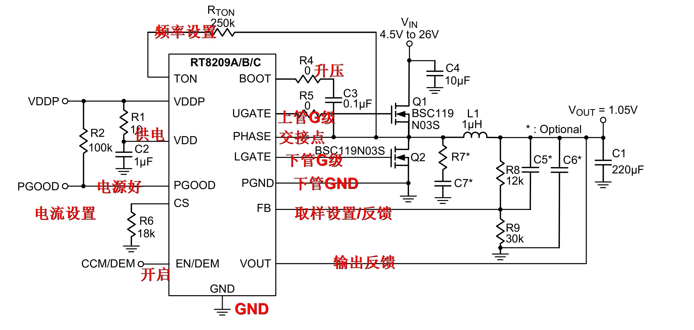
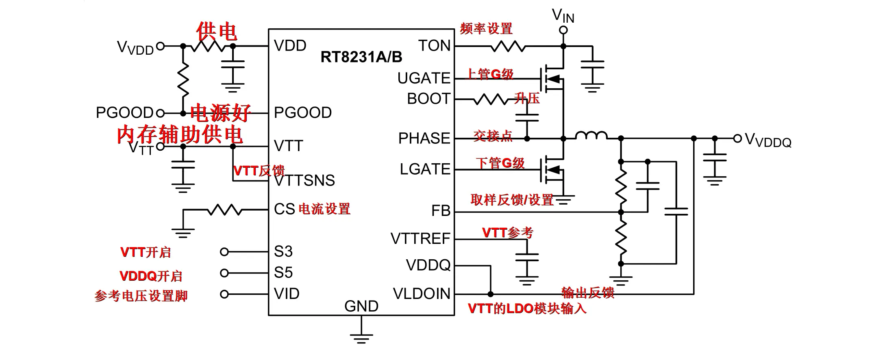

# Buck 电路实例

> 好运宝宝提供的两张电源芯片教学应用电路图，是学习 Buck 拓扑的最佳入门实例。
> 一张覆盖**通用 DC-DC 降压**（任意电压输入 → 固定低压输出），
> 一张覆盖**专用 DDR 内存供电**（VDDQ + VTT 双路跟随输出）。
> 两张图串在一起，Buck 从原理到实战的全链路都有了。

---

## RT8209A/B/C — 同步 Buck 降压控制器

> **芯片定位：** Richtek 外置双 N-MOSFET 同步 Buck 控制器，COT（恒定导通时间）控制架构。
> **输入：** 4.5V ~ 26V | **输出：** 1.05V（可通过分压电阻调整）



### 引脚功能速查

| 引脚 | 中文注解 | 功能 |
|------|----------|------|
| **TON** | 频率设置 | 外接 250kΩ 电阻设定开关频率 |
| **VDDP** | — | 内部栅极驱动级供电 |
| **VDD** | 供电 | 芯片逻辑电路供电（经 10Ω + 1μF 滤波） |
| **PGOOD** | 电源好 | 开漏输出，输出电压正常时拉高 |
| **CS** | 电流设置 | 外接 18kΩ 对地电阻设定过流阈值 |
| **EN/DEM** | 开启 | 使能控制 + 轻载模式选择（CCM / DEM 节能） |
| **GND** | GND | 芯片模拟地 |
| **BOOT** | 升压 | 自举电容（0.1μF），为上管驱动提供悬浮电源 |
| **UGATE** | 上管G级 | 上桥 N-MOSFET 栅极驱动 |
| **PHASE** | 交接点 | 上下 MOS 管开关相位节点，接电感输入端 |
| **LGATE** | 下管G级 | 下桥 N-MOSFET 栅极驱动 |
| **PGND** | 下管GND | 功率地，下管驱动回路专用 |
| **FB** | 取样设置/反馈 | 输出电压经 R8/R9 分压后送入，与内部 0.3V 基准比较 |
| **VOUT** | 输出反馈 | 直接检测输出电压 |

### 外围关键元件

| 位号 | 参数 | 作用 |
|------|------|------|
| Q1, Q2 | BSC119N03S (N-MOS ×2) | 上管 + 同步整流下管 |
| L1 | 1μH | 功率储能电感 |
| C1 | 220μF | 输出主滤波电容 |
| C3 | 0.1μF | 自举升压电容（BOOT-PHASE 之间） |
| C4 | 10μF | 输入滤波电容 |
| R_TON | 250kΩ | 频率设定电阻 |
| R8 / R9 | 12kΩ / 30kΩ | 输出电压分压反馈 |
| R6 | 18kΩ | 过流保护阈值 |

### 核心公式

**输出电压计算：**

```
VOUT = Vref × (1 + R8/R9)
     = 0.3V × (1 + 12k/30k)
     = 0.3V × 1.4
     = 1.05V
```

> RT8209 内部基准 Vref = 0.3V（非标准 0.6V/0.8V），计算分压电阻时注意核对 datasheet。

### 自举驱动回路（BOOT 升压原理）

这是外置 N-MOSFET Buck 最关键的设计：

```
下管导通 → PHASE 被拉到 GND → VIN 经 0Ω 给自举电容 C3 充电
       ↓
需要开上管 → C3 电压叠加在 PHASE 电位上 → UGATE 输出 = PHASE + VC3
       ↓
上管栅极比源极高 ~5V → N-MOS 可靠导通
```

> **修板提示：** 上管击穿但下管好的情况，重点查 BOOT 电容是否失效——自举电压不够会导致上管不完全导通（线性区），发热烧毁。

---

## RT8231A/B — DDR 内存供电（VDDQ + VTT）

> **芯片定位：** Richtek DDR 内存专用供电芯片，内置一路同步 Buck（VDDQ）+ 一路跟随型 LDO（VTT），
> 同时输出 VTTREF 基准电压。单片搞定 DDR2/DDR3/DDR4 全部电源轨。



### 引脚功能速查

| 引脚 | 中文注解 | 功能 |
|------|----------|------|
| **VDD** | 供电 | 芯片自身工作电源（通常 3.3VSB） |
| **PGOOD** | 电源好 | 双路输出就绪后拉高 |
| **VTT** | 内存辅助供电 | VTT 终端匹配电压输出（= VDDQ/2） |
| **VTTSNS** | VTT反馈 | VTT 输出电压反馈，用于稳压校准 |
| **CS** | 电流设置 | 过流保护阈值设定 |
| **S3** | VTT开启 | VTT 通道使能（配合 ACPI S3 睡眠状态） |
| **S5** | VDDQ开启 | VDDQ 通道使能（配合 ACPI S5 关机状态） |
| **VID** | 参考电压设置脚 | 电平配置对应不同 DDR 世代的标准电压 |
| **VLDOIN** | VTT的LDO模块输入 | VTT 内部 LDO 的供电输入（从 VDDQ 取电） |
| **VDDQ** | 输出反馈 | 直接检测 VDDQ 输出电压 |
| **VTTREF** | VTT参考 | 输出 VDDQ/2 基准电压，供内存芯片参考端 |
| **FB** | 取样反馈/设置 | Buck 反馈引脚，分压电阻设定 VDDQ |
| **LGATE** | 下管G级 | 同步 Buck 低端 MOS 管栅极驱动 |
| **PHASE** | 交接点 | 上下管桥臂公共相位节点 |
| **BOOT** | 升压 | 上管驱动自举升压 |
| **UGATE** | 上管G级 | 同步 Buck 高端 MOS 管栅极驱动 |
| **TON** | 频率设置 | 开关频率设定电阻 |

### 双路输出拓扑

```
VIN ──→ [同步Buck] ──→ VDDQ ──┬──→ 内存颗粒核心供电
                 │              ├──→ VLDOIN ──→ [内部LDO] ──→ VTT (=VDDQ/2)
                 │              └──→ 内部分压 ──→ VTTREF (=VDDQ/2) 基准输出
                 │
            FB ← 分压反馈
```

**关键设计：VTT 跟随 VDDQ**

- VTT LDO 从 VDDQ 取电，内部硬件固定输出 `VDDQ / 2`
- 不需要额外稳压器、不需要单独校准
- VDDQ 变（DDR2=1.8V / DDR3=1.5V / DDR4=1.2V），VTT 自动跟随变为一半
- VTTREF 同样 = VDDQ/2，供内存芯片地址/命令线的参考端

### S3/S5 电源状态控制

| 状态 | S5 | S3 | VDDQ | VTT | 说明 |
|------|:--:|:--:|:----:|:---:|------|
| S0 (开机) | H | H | ON | ON | 正常工作 |
| S3 (睡眠) | H | L | ON | OFF | 内存保持自刷新，VTT 关闭省电 |
| S5 (关机) | L | L | OFF | OFF | 全部关闭 |

> **修板提示：** 不开机时，先量 S5/S3 引脚电平——如果 EC 没发出高电平使能信号，芯片根本不会启动。供电正常但没输出，别急着换芯片，查使能脚。

---

## 两张图的学习要点

| 图 | 核心知识点 | 修板常用 |
|----|-----------|----------|
| RT8209 Buck | BOOT 自举原理、FB 分压计算、COT 架构、PGOOD 监控 | 上管击穿 → 查 BOOT 电容；输出不对 → 算分压电阻 |
| RT8231 DDR | VDDQ+VTT 双路跟随、S3/S5 ACPI 控制、VTTREF 基准 | 内存不稳 → 量 VTT 是否 = VDDQ/2；没输出 → 查 S5/S3 |

> 看懂这两张图，主板上 90% 的 Buck 供电电路都能举一反三——其他芯片只是引脚名和分压电阻不同，拓扑完全一致。
