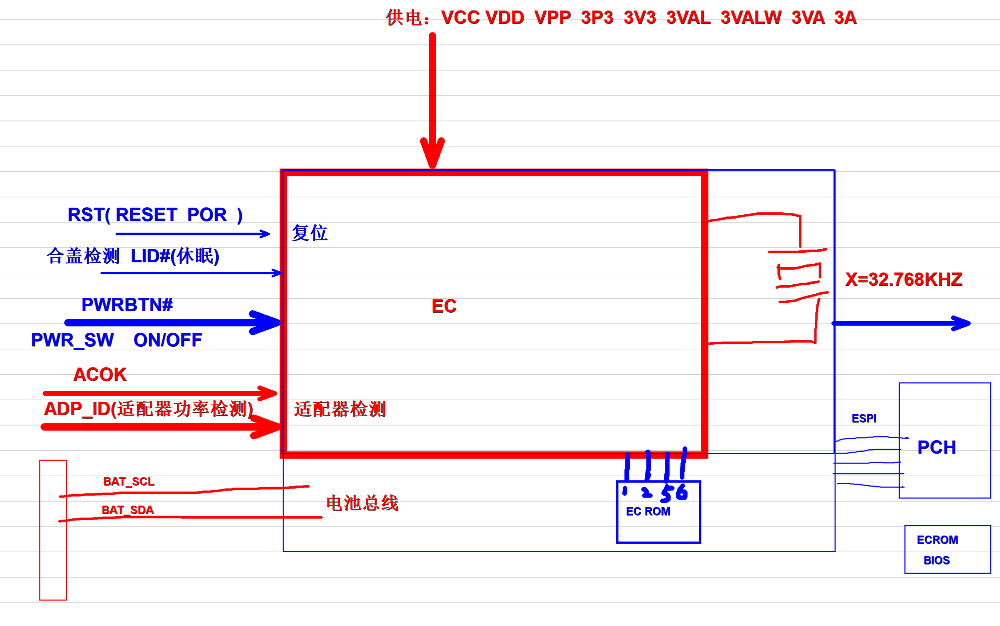
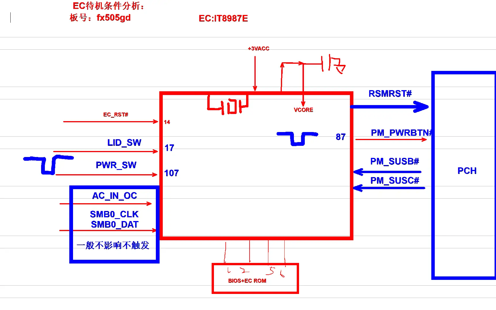

# EC 待机架构

笔记本电脑的待机电源和开机时序核心，所有开机流程的起点。

---

## EC 整体架构



EC (Embedded Controller) 是笔记本主板上真正的电源管理核心，在按下开机键之前它就已经在工作了。

---

## 待机供电

当主板插上电池或者适配器的那一刻起，EC 就会得到以下几组待机供电：

| 电压 | 名称 | 说明 |
|------|------|------|
| **VCC** | 核心供电 | EC 内核工作电压，通常 1.8V |
| **VDD** | IO 供电 | EC 引脚输入输出电压，通常 3.3V |
| **VPP** | 编程电压 | 固件烧录电压 |
| **3VALW** | 总是有效 3.3V | 真正的待机电压，只要有电池/适配器就存在 |
| **3VA** | 待机 3.3V | 唤醒后才会开启的待机电压 |
| **3A** | 运行 3.3V | 完全开机后才会开启 |

> 💡 很多人搞不清 3VALW、3VA、3A 的区别：
> - ✅ 插电池就有：3VALW
> - ✅ 按开机键后有：3VA
> - ✅ 亮屏后才有：3A

---

## 输入信号

### 🔄 复位信号
- **RST / RESET / POR**：上电复位信号
- 所有供电稳定后，EC 才会释放自己的复位
- 复位信号不正常是最常见的不开机故障

### 📑 适配器检测
- **ACOK**：适配器插入信号，来自充电芯片
- **ADP_ID**：适配器功率检测，通过电阻分压识别 45W/65W/90W/135W 等不同功率的适配器
- EC 会根据适配器功率动态调整充电电流和系统性能

### ⌨️ 用户输入
- **PWRBTN# / PWR_SW**：开机键信号，低有效
- **LID#**：合盖检测信号，休眠/唤醒控制

### 🔋 电池接口
- **BAT_SCL / BAT_SDA**：SMBus 总线，直接和电池通讯
- EC 直接读取电池电压、温度、剩余容量、循环次数等所有信息

---

## 外围设备

### 🕒 32.768KHz 晶振
EC 的心跳，没有它 EC 绝对不会工作：
- 这是 EC 唯一的时钟源
- 待机时整个主板只有这个晶振在震动
- 晶振虚焊是排名第一的 EC 故障

### 💾 EC ROM
- 通常是 128KB 或者 256KB 的 SPI Flash
- 保存 EC 固件程序、开机 LOGO、键盘映射、风扇策略
- 很多笔记本的 EC ROM 和 BIOS ROM 是分开的

### 📡 PCH 通讯
- 现代主板使用 ESPI 总线连接 EC 和 PCH
- 老主板使用 LPC 总线
- 所有的开机、关机、休眠、唤醒命令都通过这条总线传递

---

## 待机状态

EC 有三个完全独立的电源域：

| 状态 | 活动模块 | 电流 |
|------|----------|------|
| **深度待机** | 只有 32K 晶振和复位电路在工作 | ~300µA |
| **待机** | EC 内核运行，扫描键盘，等待开机键 | ~5mA |
| **运行** | 所有功能全开 | ~50mA |

> 💡 笔记本关机掉电快，90% 都是因为 EC 没有真正进入深度待机状态。

---

## 常见故障

| 故障现象 | 90% 概率的原因 |
|----------|--------------|
| 插电大电流，EC 发烫 | EC 本身击穿损坏 |
| 按开机键完全没反应 | 32.768KHz 晶振不起振 |
| 拔掉适配器就掉电 | 电池 SMBus 通讯异常 |
| 自动开机或者自动关机 | EC 固件损坏，需要重刷 |
| 风扇狂转不降速 | EC 温度检测脚开路 |

---

## 实战案例：FX505GD EC 待机触发分析

以下是以华硕 FX505GD（EC: IT8987E）为例的完整 EC 待机触发逻辑分析，由维修从业者手绘整理：



### 图上关键信号解析

**EC 工作三大前提**（缺一不可）：
1. **供电**：+3VACC 待机供电 + 10μF 滤波电容
2. **时钟**：32.768KHz 晶振 — EC 的心跳
3. **复位**：EC_RST#（14脚），低电平有效

**开机触发链路**：
```
LID_SW(17脚) 合盖检测 → PWR_SW(107脚) 开机键 → EC 检测到按键
→ RSMRST# 通知 PCH 待机就绪 → PM_PWRBTN#(87脚) 请求 PCH 开机
→ PCH 回复 PM_SUSB# / PM_SUSC# → EC 开启后续供电
```

**维修优先级提示**：
- AC_IN_OC、SMB0_CLK、SMB0_DAT 这三个信号异常 **一般不导致不触发**，排查时可跳
- BIOS + EC ROM 连接到 EC 的 4/2/5/6 脚