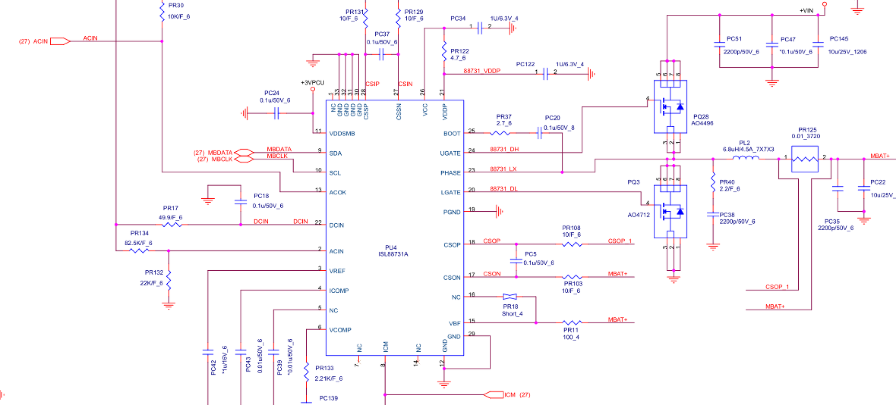
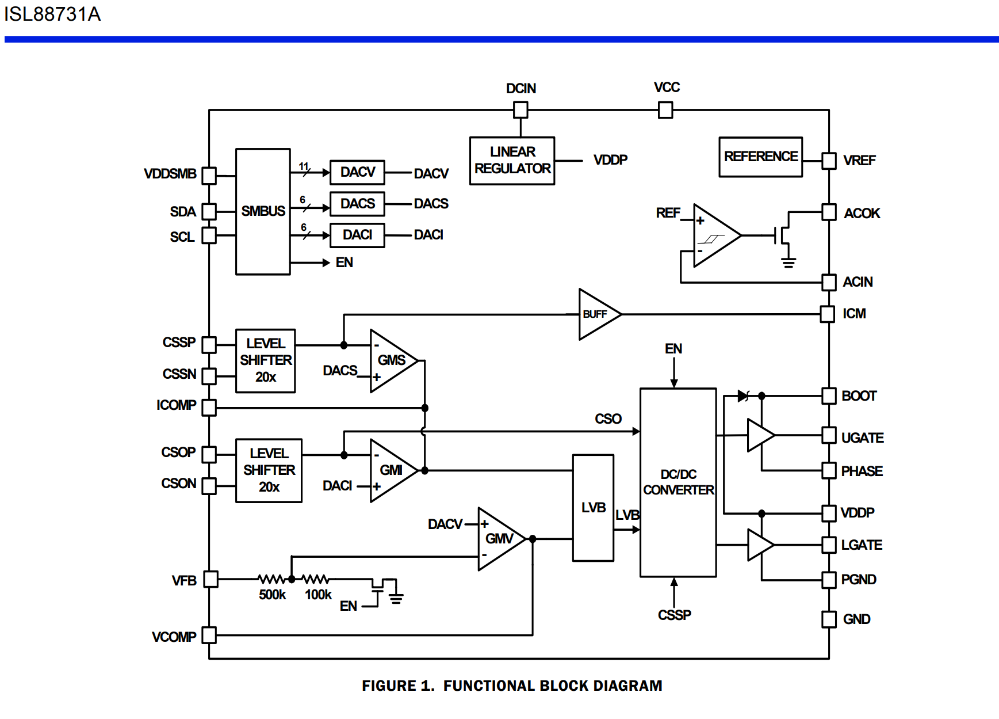

# ISL88731A 适配器插拔时序说明

---

## 内部逻辑验证

所有我们之前说的时序，都可以在这个官方内部框图里找到对应：

你可以很清楚地看到：
- ACOK就是一个干净的比较器，后面直接接开漏管，没有任何去抖，没有任何延时，所以拔出的时候才会零延迟
- 所有栅极驱动的电源全部来自VDDP，和VCC完全无关，所以VDDP才是真正的闸门
- PHASE是接到DC/DC转换器的输入端，不是输出端，所以它确实是输入引脚
- 整个芯片没有任何隐藏的状态机，它做的每一件事，你都可以在这个图上找到对应的电路

---

## 适配器插入过程

当你把适配器插进笔记本的那一刻起，整个过程是这样发生的：

1.  适配器物理插入，ACIN电压开始上升。大约50微秒后，DCIN电压超过8V，芯片内部的欠压锁定释放，所有内部偏置电路开始工作。

2.  再经过大约200微秒，VDDP（就是我们说的REGN）电压稳定上升到5.2V。这是整个过程最重要的分界点，从这一刻开始，所有的栅极驱动电路、模拟比较器才真正准备好工作。

3.  当适配器电压上升到大约11.4V的时候，ACIN引脚的分压超过2.4V，内部适配器检测比较器触发。

4.  但是ISL88731A本身完全没有去抖电路，所以接下来的100毫秒里什么都不会发生。这段时间完全靠外部的PR17电阻和PC18电容进行RC滤波，滤除适配器插入时的弹跳和毛刺。

5.  100毫秒的去抖时间结束后，ACOK引脚被拉低，通过中断通知EC：适配器已经稳定插入了。

6.  EC收到中断后大约10毫秒，会开始通过SMBus总线写入充电电压、充电电流、适配器电流限制这些参数。

7.  所有寄存器配置完成后，Buck转换器才会真正开始工作。充电电流会以每400微秒增加128mA的速度缓慢爬升，直到达到设定值。对于最大8A充电来说，整个软启动过程大约需要25毫秒。

从你插进适配器，到充电真正开始，整个过程大约需要130毫秒左右。

---

## 适配器拔出过程

拔出适配器的响应速度要快得多，整个过程在微秒级别完成：

1.  适配器物理拔出，ACIN电压开始下降。

2.  当适配器电压降到11.4V以下，ACIN引脚分压低于2.4V的一瞬间，ACOK会被立即拉高，没有任何去抖，没有任何延迟，整个过程不会超过5微秒。

3.  EC会在1微秒内收到这个中断，立即知道适配器已经被拔掉了。

4.  几乎同时，VDDP LDO会被硬件关断，所有栅极驱动电源消失，上下管立即停止所有开关动作。

5.  剩下的事情就交给外部电路了，通常会在100微秒到1毫秒之间完成从适配器到电池的切换。

这就是ISL88731A最大的特点：插入的时候慢得要死要等100毫秒，拔出的时候比谁都快，零延迟响应。

---

## 设计上的取舍

这个看起来很奇怪的特性其实是故意设计的：
- 插入的时候慢是为了绝对可靠，宁可晚一点，也绝对不能误触发
- 拔出的时候快是为了系统安全，适配器一拔，必须立刻通知EC，一秒钟都不能等

这也是为什么这个已经15年的老芯片，直到今天还有大量的人在用的原因。它不聪明，没有花里胡哨的功能，但是它做对了最重要的两件事：不该开的时候绝对不开，该关的时候立刻就关。
