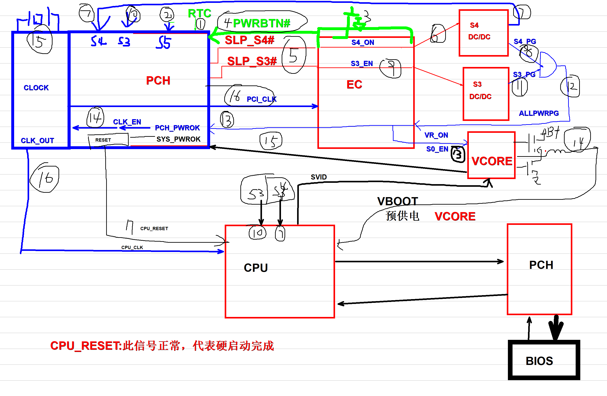

# 上电时序与开机流程

笔记本从插电到正常使用的完整上电先后顺序，以及故障排查的优先级指引。

---

## 通用上电时序

主板上各电压产生的先后顺序，按 ACPI 电源状态划分：


### 硬启动阶段（故障占比 60%~70%）

这是故障最高发区域——大部分不开机问题都出在这里。

| 电源状态 | 上电顺序 |
|----------|----------|
| **G3** 完全断电 | RTC 电路（插电就工作的实时时钟） |
| **S5** 待机 | 隔保（公共点）→ 3V/5V 待机 → EC/PCH 待机条件 → 充电电路 |
| ⚡ 触发 | **按下开机键** — 待机转开机的分界点 |
| **S4** 休眠 | 内存主供电 → 桥供电 → 二级供电 |
| **S3** 睡眠 | 内存辅助供电 → CPU 辅助供电 → 二级/三级供电 |
| **S0** 正常运行 | CPU 供电 → 显卡供电 → **时钟电路 → 复位电路** |

> 💡 硬启动收尾：时钟电路和复位电路是最后的关卡，这两步过了才算硬启动完成。

---

## 详细信号级时序图

这是一张标注了 16 个关键信号步骤的详细上电时序流程图：



> 🎯 这张图精确到具体信号的交互顺序，是笔记本电脑硬件开机流程最核心的知识。理解这个时序图，就理解了 80% 的笔记本硬件工作原理。

### 16 步详细信号流程

| 步骤 | 信号/事件 | 说明 |
|------|----------|------|
| **1** | **RTC 就绪** | 插上适配器或电池后，RTC 实时时钟电源首先工作 |
| **2** | **PWRBTN# 按下** | 用户按下电源键 |
| **3** | **EC 响应** | EC 检测到开机信号，通知 PCH |
| **4** | **S4_ON 输出** | EC 开启 S4 深度睡眠电源轨 |
| **5** | **S4_PG** | S4 电源输出稳定 |
| **6** | **SLP_S4# 释放** | PCH 解除深度睡眠 |
| **7** | **S3_EN 输出** | EC 开启 S3 待机电源轨 |
| **8** | **S3_PG** | S3 电源输出稳定 |
| **9** | **ALLPWRPG** | 所有次要电源就绪 |
| **10** | **VR_ON / S0_EN** | EC 开启 CPU 核心电源 |
| **11** | **VCORE 输出** | CPU 核心电源稳定 |
| **12** | **SVID 通信** | CPU 与 VCORE 芯片通信设置电压 |
| **13** | **PCH_PWROK** | PCH 确认所有电源就绪 |
| **14** | **CLK_EN** | 时钟芯片开始输出所有时钟 |
| **15** | **所有时钟稳定** | PCI_CLK、CPU_CLK 正常输出 |
| **16** | **CPU_RESET# 释放** | ✅ **硬件启动 100% 完成**

---

### 软启动阶段（故障占比 20%~30%）

供电、时钟、复位都正常后，主板开始硬件自检：

```
POST 开机自检 → 自检 CPU → 自检内存 → 自检 PCH → 自检显卡
→ 自检 EC → 选择显示通道 → 读 BIOS → 自检外设（硬盘/光驱/USB/键盘等）
```

### 系统阶段（功能性故障）

硬件自检全部通过后进入系统加载：

```
加载系统 → 加载驱动 → 加载软件 → 用户正常使用
```

这个阶段的故障属于系统、驱动、软件类问题，不属于硬件上电/自检故障。

---

## PCH 待机条件分析（G531GW 实战案例）

以下是以华硕 G531GW 为例的 PCH 待机开机条件分析，梳理了 PCH 内部各电源域与 EC 的信号交互：


### PCH 内部电源域

PCH 内部分为三个不同休眠等级的供电分区：

| 分区 | 别称 | 触发条件 | 说明 |
|------|------|----------|------|
| **RTC** | 「植物人状态」 | CMOS 电池有电就工作 | 保持时间更新、保存 BIOS 设置的最低功耗模块 |
| **DSW** 深睡 | 深度睡眠 | 插电后最先启动 | VCCDSW_3P3、DSW_PWROK 就绪后激活 |
| **PRIM/SUS** 浅休眠 | 准备开机 | PCH 收到开机请求后 | VCCPRIM_3P3/1P8/1P05 供电就绪 |

### EC ↔ PCH 关键交互信号

| 信号 | 方向 | 作用 |
|------|------|------|
| **PWRBTN#** | EC → PCH | 开机请求：EC 检测到按键后发给 PCH |
| **RSMRST#** | EC → PCH | 待机就绪：EC 通知 PCH 所有待机供电正常 |
| **SLP_S4# / SLP_S3#** | PCH → EC | 开机授权：PCH 自检正常后允许 EC 开启后续供电 |
| **PM_SLP_SUS#** | PCH → EC | 待机睡眠许可 |
| **ESPI 总线** | 双向 | PCH ↔ EC 专用通讯总线（ESPI_CS/CLK/RST/IO） |

### 上电流程（图上标注的步骤）

1. CMOS 电池供电 → RTC 电路工作
2. 插入适配器/电池 → 待机 3V/5V 产生 → EC/PCH 待机模块供电
3. PCH DSW 模块激活（VCCDSW_3P3、DSP_PWROK）→ 按下开关，EC 发 PWRBTN# 请求开机
4. PCH PRIM 模块激活 → RSMRST 抬高 → SLP_SUS# 给 EC → EC 开启 SUS 电压
5. PCH 内部 G3 → DSW → PRIM 模块全部就绪 → ESPI 总线开始通讯
6. ESPI 通讯正常 → PCH 发出 SLP_S4# / SLP_S3# 授权开机
7. EC 发出 S4_ON → 开启内存主供电等后续电压
